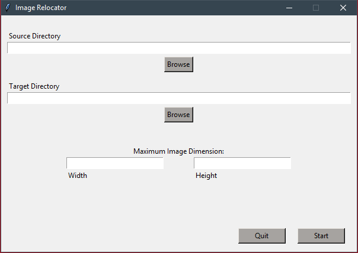

# Image Relocation

Tool to move images under a defined size between directories

Image Relocation enables users to move all images, less than or equal to a defined dimension, from a source directory to a target directory. This program was originally made to find all low resolution images in a target folder so they could be upscaled.

## Getting Started
### Windows installation
To use Image Relocation on Windows, download the latest version of the application [here]()

### Nonspecific OS Installation
- Download or clone this repository
- Download Python
- Install the following libraries: numpy, Pillow, and tkinter
- Run the gui.py file
